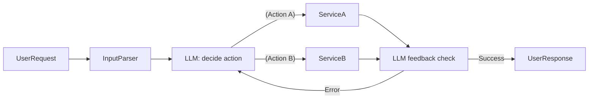
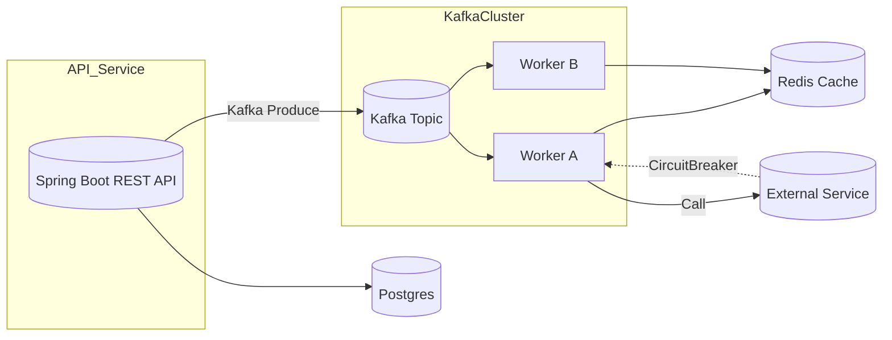
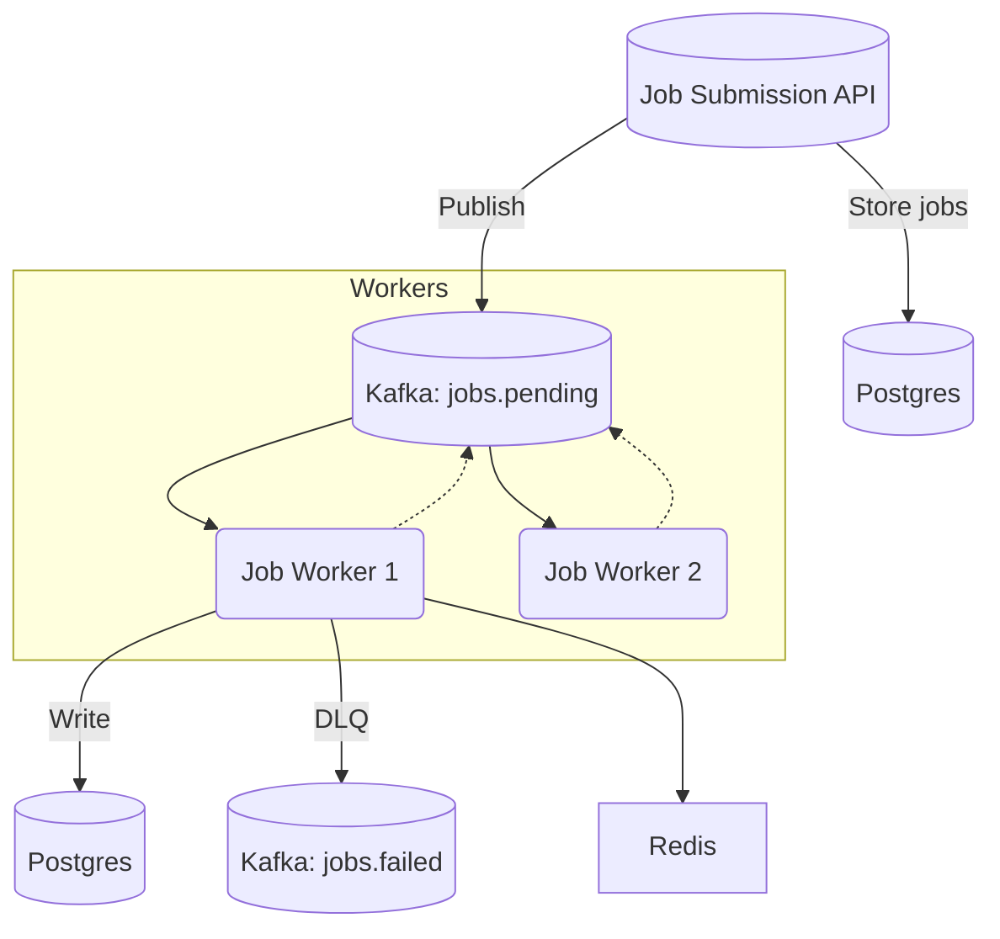
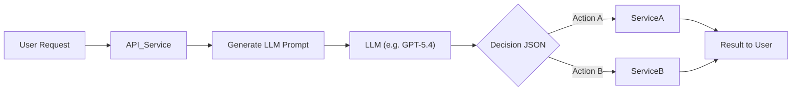

# Executive Summary  
This 26-week plan lays out a **rigorous, week-by-week roadmap** for a Java backend engineer to reach a ₹50+ LPA base salary.  It combines deep Java fundamentals (collections, concurrency, JVM, threads, Spring Boot, API design, idempotency), algorithm/data-structure practice (NeetCode 150 progression), **two distributed projects**, and a **layered agentic AI integration**.  We build two microservice systems (an Orchestration/Integration Platform and a Job Processing System) **fully distributed** with Kafka, Redis, retries, DLQs, idempotency, observability, and CI/CD.  Only after building these systems do we add minimal viable agentic AI (LLM-based routing/tool-calling with cost/latency tracking).  The plan includes daily coding tasks (~2 hrs DSA, 2 hrs project work), weekly deliverables (code, design docs, diagrams), interview-aligned outputs (resume bullet points and talking points), and Trello-style tracking.  

Throughout, we cite authoritative sources: Java/Tutorials on locks【5†L95-L104】【6†L101-L104】, Spring Boot docs on observability【9†L367-L374】, Kafka docs on scalability【31†L117-L126】, Redis on low latency and fault tolerance【33†L207-L215】【33†L214-L220】, agentic AI definitions【20†L72-L80】【21†L201-L210】, and more. This is a **deep, actionable plan**, leaving no gap: by Day 180 you’ll have **two production-grade distributed systems** (with source code and docs) and demonstrable AI-enhanced features, ready for interviews.

## Weekly Roadmap Overview (26 Weeks)  

| Weeks      | Focus/Topics                                                | Deliverables / Projects                           | Interview/Resume Output                              |
|------------|------------------------------------------------------------|--------------------------------------------------|------------------------------------------------------|
| **1–4**    | Java Core & DSA: Collections (HashMap internals), threading (Threads, Executors), Locks/Synchronization, concurrent collections, basic OS/DB. **NeetCode DSA 150:** arrays, pointers, trees. | Completed small demos: custom HashMap, LRU cache, thread-safe queue. Understanding of locks & thread pools【5†L95-L104】【7†L96-L104】. | Resume: *“Implemented thread-safe data structures (LRU cache, queue) in Java using concurrency primitives.”* Talking points: how intrinsic locks work【5†L99-L104】, advantages of thread pools【7†L106-L114】. |
| **5–8**    | Concurrency + Spring Boot basics: ReentrantLock, condition, executor services, synchronization【6†L101-L104】【6†L106-L110】. Spring Boot REST controllers, API design, idempotency, basic RDBMS (JPA/Hibernate). NeetCode DSA: graphs, heaps. | Built a simple Spring Boot CRUD microservice with well-defined REST API (input validation, error handling, idempotent endpoints). JUnit tests + Dockerfile. | Resume: *“Built Spring Boot microservices (REST API, JPA) with idempotent design and unit tests.”* Prepare to explain thread-pool scaling (fixed vs cached pools【7†L106-L114】) and idempotent operations. |
| **9–15**   | **Project 1:** Orchestration/Integration Platform (in Java/Spring). Microservices + Kafka. Topics: event-driven design, Kafka producers/consumers, Redis caching, retry logic, idempotency, circuit breaker, monitoring (Micrometer)【9†L367-L374】. Continue DSA (mixed revision). | Deliverable: **Orchestration Platform** code. Features: HTTP API service, JSON workflow config, Kafka topic for jobs, worker services, retry/DLQ, Redis cache, structured logging (SLF4J), Micrometer metrics (prometheus). Diagram (mermaid). | Resume: *“Designed & implemented a Kafka-backed orchestration platform in Java: REST API, distributed workers, retries, DLQ and Redis caching.”* Talking points: “Kafka is fault-tolerant, enabling durable event logs【31†L117-L126】”, “Used retry with DLQ for resilience”, “Observability via metrics/tracing【9†L367-L374】.” |
| **12–18**  | **Project 2:** Job Processing System (in Java/Spring). Focus: high-concurrency, scheduling, priority queues, rate-limiting. Topics: Java Threads/executors deep dive, concurrent collections, backpressure patterns, database scaling (sharding/partitioning), circuit breaker【14†L47-L52】, CI/CD pipeline basics. | Deliverable: **Job Processor** code. Features: job submission API, priority Kafka queues, worker thread pools, in-memory & Redis caching, circuit-breaker for external calls, throughput testing scripts. Diagram (mermaid). | Resume: *“Built a distributed job scheduler with concurrent workers (Java ThreadPools) and Kafka, including fault-tolerance (circuit-breakers, backpressure) and CI/CD.”* Interview: design diagram for this service, explain thread pool vs new thread, etc. |
| **16–22**  | **Agentic AI Integration:** LLM basics (tokens, prompts, API usage). Integrate AI into both projects: add an LLM-driven routing/decision layer. Topics: prompt structuring, tool-calling patterns, minimal memory (RAG), fallback logic, cost/latency tracking. Reliability: output validation, retry, caching LLM results. | **AI-enhanced Orchestration:** LLM chooses workflow path or API action. **AI-enhanced Job Processor:** LLM classifies tasks or triggers subjobs. Code snippets + prompt examples. Logging for each AI decision, metric of token usage. | Resume: *“Integrated ChatGPT-like LLM into backend: LLM-powered workflow routing and tool-calling. Tracked latency and cost, with retry and fallback for reliability.”* Prepare to explain an agentic step-by-step flow (see flowchart) and how to mitigate LLM errors (e.g. validation, caching). |
| **23–26**  | **Interview Prep & Polish:** DSA final review, mock design interviews. Finalize resume (“Distributed Systems, Kafka, Spring Boot, AI”). Complete CI/CD pipeline (GitHub Actions/Jenkins for building/testing). Simulate load tests (JMeter) and fix bottlenecks. Apply to jobs. | Deliver all documentation: architecture diagrams, code repos, Docker images, CI/CD config. Trello board with tasks done. Final mock interviews with feedback. | Resume summary bullet: *“Engineered two distributed Java microservices systems (Kafka, Redis, Spring Boot) and added LLM-based AI decision layer.”* Interview Q&A (see samples below).  

> **Time per day:** Plan for 4–5 focused hours. Example: 2 hrs coding (project or DSA problems), 1–1.5 hrs new concepts/theory, 1 hr review/test coverage. Weekends: extended sessions (4–6 hrs) for deep work (design or code).  

---

## Java Fundamentals & DSA (Weeks 1–8)  
We rebuild core Java and algorithm skills, with **authoritative guidance**:
- **Data Structures:** Use NeetCode 150 schedule (arrays, pointers, trees, graphs, heaps). For each new pattern, *write code by hand* then test it. Target solving medium problems in <30 min.  
- **Collections Internals:** Read Oracle docs. E.g., HashMap uses *buckets and linked lists* (or trees after threshold), ensures ~O(1) access on average【5†L99-L104】. Practice by **implementing a simple HashMap** to reinforce collision handling.  
- **Concurrency Basics:** Study Java Tutorials on locks and thread pools【5†L95-L104】【7†L96-L104】. Key points: `synchronized` uses an intrinsic lock per object【5†L99-L104】; only one thread can hold it at a time【6†L101-L104】. Use `ReentrantLock` for advanced control (e.g. `tryLock` with timeout)【6†L105-L113】. **Exercise:** Build a thread-safe queue with `synchronized` and then with `ReentrantLock`.  
- **Executors & Thread Pools:** Learn `Executors.newFixedThreadPool`, `newCachedThreadPool`【7†L106-L114】. Understand that pools reuse threads to save memory/time【7†L96-L104】 and cap concurrency to degrade gracefully under load【7†L112-L120】. **Exercise:** Write code using `Executors.newFixedThreadPool(5)` to process submitted Runnables.  
- **Synchronization Constructs:** Practice `synchronized` blocks vs `java.util.concurrent` locks. Observe that *only one thread can own a Lock or intrinsic lock at a time*【6†L101-L104】. Note reentrancy: a thread can reacquire a lock it already owns【5†L178-L184】.  
- **OS/Networking/DB:** Brief study – how OS schedules threads, context switching costs; how HTTP requests flow; basics of SQL indexes, transactions and ACID. This supports later system design (no direct citations needed for those basics).  

**Deliverables (Weeks 1–8):**  
- Mini-demos:  
  - **Custom HashMap** (Week 1): Implements put/get with buckets. Demonstrates understanding of hash collisions.  
  - **LRU Cache** (Week 3): Use LinkedHashMap or manual with HashMap+DoubleLinkedList.  
  - **Thread-Safe Queue** (Week 4): One using `synchronized`, another using `BlockingQueue` or `ReentrantLock`.  
  - **Spring Boot Hello API** (Week 7): Start a simple REST app, with one endpoint; demonstrate idempotency (e.g. safe POST).  

**Interview Prep Points:**  
- Be ready to *explain how `synchronized` works*: “Every Java object has an intrinsic lock; when a method/block is synchronized, a thread must acquire the lock (blocking others)【5†L99-L104】.”  
- *Thread pool advantage*: avoids per-request thread cost【7†L96-L104】 and throttles concurrency to avoid OOM【7†L112-L120】.  

## System Design & Projects (Weeks 9–18)  
We now **design and build two distributed systems** in parallel, deepening system design skills:

### Project 1: Orchestration/Integration Platform  
**Purpose:** Execute configurable workflows in distributed services.  

**Architecture (mermaid diagram):**  
```mermaid
graph LR
  Client -->|REST JSON| API_Service[API Service (Spring Boot)]
  API_Service --> DB[(Postgres)]
  API_Service -->|Write events| Kafka[Kafka Topic: `workflows.events`]
  Kafka --> WorkerA[Worker Service A]
  Kafka --> WorkerB[Worker Service B]
  WorkerA --> Redis[(Redis Cache)]
  WorkerB --> Redis
  WorkerA -->|Call downstream| Downstream[(External API/Service)]
  Downstream -.-> CircuitBreaker
  WorkerA -.-> CircuitBreaker
  Redis -- Publish/Subscribe --> WorkerA
```
*Figure: Orchestration platform with API service, Kafka, workers, Redis, external calls (Circuit Breaker in place).*  

**Components & Tech:**  
- **API Service (Spring Boot):** Exposes JSON REST endpoints for creating and querying workflows. Uses Spring Data JPA (Postgres) for persistence. Enforce **idempotency** by unique request IDs in DB.  
- **Kafka (Event Bus):** A topic (e.g. `workflow.tasks`) transports tasks. Kafka is *distributed, scalable and durable*【31†L117-L126】, so tasks aren’t lost if a consumer crashes. Consumer groups allow multi-worker scaling (Balancing via partitions).  
- **Workers (Java microservices):** Multiple instances (Docker/K8s) consume Kafka partitions. Use a `ThreadPoolExecutor` internally to process tasks concurrently. Each task: parse workflow JSON, perform steps (e.g. call downstream services or compute results).  
- **Reliability:** On failure, **retry** the task (up to N times). If still failing, send to a *Dead-Letter Topic* (DLQ). IDempotency (e.g. dedupe via Redis or DB flags) prevents double-execution. Use a **circuit breaker** (e.g., Resilience4j) around external calls to avoid cascading failures【14†L47-L52】.  
- **Observability:** Use Spring Boot Actuator + Micrometer to export metrics. Define counters/timers for request rate, task latency, error count. Log each event with SLF4J (structured JSON logs). Endpoint health checks (using actuator health) and distributed tracing (OpenTelemetry) to track flows.  
- **Cache/Redis:** Use Redis as a fast cache or for pub/sub (e.g. publish state changes). Redis provides *sub-millisecond latency and linear scaling*【33†L207-L215】. Its cluster mode gives multi-AZ failover【33†L214-L220】. Use Redis to store intermediate state or cache DB lookups.

**Weekly Breakdown (9–15):**  
- *Week 9:* Define domain and data model (workflow config, task). Set up Spring Boot project skeleton. Implement API endpoints, DB schema (using Flyway/Liquibase). Ensure input validation.  
- *Week 10:* Integrate Kafka: configure a topic, write a producer in API service when new workflow is created (e.g. send initial task). Set up a basic consumer in one worker service (log received event).  
- *Week 11:* Implement Worker logic: dispatch tasks from Kafka. Use `ThreadPoolExecutor` to handle tasks in parallel. Implement basic tasks (e.g. call a mock downstream or perform calculation).  
- *Week 12:* Add error handling: implement retry policy (e.g. exponential backoff) on exceptions. On repeated failure, publish to a DLQ topic. Implement basic idempotency checks (track completed tasks in DB or Redis to skip duplicates).  
- *Week 13:* Add **Redis caching** for DB results (cacheable data) or pub/sub to notify state changes.  
- *Week 14:* Implement Circuit Breaker (e.g. Resilience4j) around any external service calls【14†L47-L52】.  
- *Week 15:* Add observability: Micrometer metrics (task execution time, error count) and structured logs. Create a dashboard (e.g. Prometheus/Grafana) to monitor.  

### Project 2: Job Processing & Scheduling System  
**Purpose:** Process heterogeneous jobs with priority/scheduling.  

**Architecture (mermaid diagram):**  
```mermaid
flowchart TD
  JobClient -->|POST /jobs| JobAPI[Job API (Spring Boot)]
  JobAPI --> JobDB[(Postgres)]
  JobAPI -->|enqueue| Kafka[Kafka Topic: `jobs.pending`]
  Kafka --> JobWorker[Job Worker Service]
  subgraph JobWorker
    JW1(Worker Instance 1) -->|consume| Kafka
    JW2(Worker Instance 2) -->|consume| Kafka
  end
  JobWorker -->|write results| ResultDB[(Postgres)]
  JobWorker -->|DLQ| DLQ[Kafka Topic: `jobs.failed`]
  JobWorker --> RedisCache[(Redis)]
  JobWorker -.->|CircuitBreaker| ExternalAPI
```
*Figure: Job processing with client API, Kafka queue, worker pool, DB, DLQ and cache.*  

**Components & Tech:**  
- **Job API (Spring Boot):** Endpoint to submit jobs (with payload and priority). Writes to Postgres. Immediately publishes job event to Kafka (`jobs.pending`). Ensure idempotent submission by unique job IDs.  
- **Kafka (Job Queue):** Use priority if needed (separate topics or priority within messages). Kafka’s consumer groups distribute partitions among multiple worker instances for load-balancing【12†L132-L140】.  
- **Workers:** Spring services consuming from `jobs.pending`. Use a fixed thread pool (size 4–10) to process jobs concurrently. Implement job scheduler logic (e.g. delay/rescheduling, priority handling).  
- **Reliability:** If a job fails, retry with backoff (e.g. up to 3 times). On persistent failure, write to a **Dead-Letter Topic** `jobs.failed`. Use Redis to store transient state (e.g. heartbeat info, in-progress keys) to prevent duplicate picks.  
- **Backpressure:** Monitor Kafka lag. If lag grows (consumers slower than producers), autoscale worker replicas. If queue saturates, shed load (drop low-priority jobs or return 503)【15†L159-L163】.  
- **Observability:** Similar metrics (jobs queued, processing time). Log key steps.  
- **CI/CD & Testing:** Create a Jenkins/GitHub Actions pipeline: compile, run unit tests, build Docker image, deploy to dev cluster. Write integration tests (e.g. Spring Boot tests hitting API).  

**Weekly Breakdown (12–18):**  
- *Week 12:* Set up Job API (Spring Boot), DB schema for jobs. Implement job submission endpoint. Create Kafka topic `jobs.pending`.  
- *Week 13:* Write producer in Job API to publish new jobs to Kafka. Start a simple worker that consumes and logs jobs.  
- *Week 14:* Implement full worker logic: process job (simulate workload), mark job done. Write results back to DB or publish completion event. Use Java `ScheduledExecutorService` for any delayed jobs.  
- *Week 15:* Add concurrency: use fixed thread pool; ensure thread safety if jobs share resources. Use `ConcurrentLinkedQueue` or `ConcurrentHashMap` for any in-memory job state.  
- *Week 16:* Implement retries with exponential backoff. If still failing after N tries, publish to `jobs.failed` topic (simulate DLQ). Ensure idempotency (check job ID store in Redis/DB).  
- *Week 17:* Add Redis caching for job results or intermediate data. Introduce circuit breaker on any external step (e.g. if a job calls an API).  
- *Week 18:* Observability and load testing. Write a JMeter script to simulate 1000 jobs, measure throughput. Identify bottlenecks, tune thread pools or partition count.  

---

## Agentic AI Integration (Weeks 16–22)  
After core systems are live, we **embed intelligence**:

- **LLM Basics:** Quickly learn how to call an LLM API (e.g. OpenAI GPT-5.4)【17†L669-L674】. Understand token-based cost and latency trade-offs.  
- **Routing & Tool-Calling:** Modify each project to ask the LLM to make decisions: e.g., in the Orchestration platform, “Given this workflow JSON, pick the next API endpoint to call.” In the Job system, “Classify job type or enrich data via LLM.” Show how to **invoke an LLM as a “decision service.”**  
- **Agent Flow:** Design a flowchart for an *agentic workflow*. For example:


*Figure: Agentic decision flow – the LLM chooses between Service A or B, with a feedback loop for verification.*  

- **Tool Integration:** Use an LLM like OpenAI’s ChatGPT (Agent Mode) with tools (e.g. code execution, web search). In our systems, simulate this by calling microservice APIs as “tools.” Use the LLM to generate structured JSON for calls.  
- **Reliability:** Always validate LLM output. If it suggests an invalid action, fallback to a default path. Cache LLM outputs for repeat queries (using Redis). Track token usage and add cost logging to metrics. Monitor latency (sometimes split long tasks).  
- **Observability:** Tag every event with LLM “decision time”, output length, cost. Collect these metrics (e.g. tokens used per workflow) for tuning.  

**Prompt Examples:**  
- Orchestration: “Given a loan workflow JSON, choose next step (e.g., call `CreditCheckService` or `NotificationService`), return action as JSON.”  
- Job System: “Classify this job’s text description into categories [analytics, cleanup, transform].”  

By the end of Week 22, both systems should demonstrate a simple agentic capability: **the backend consults the LLM to drive decisions or actions**, with engineering safeguards (retries, monitoring).  

*Citations:* Agentic AI is about LLMs that *“can reason over multiple steps, plan actions, call external tools or APIs, and adapt based on feedback”*【20†L72-L80】. MIT Sloan notes agentic systems are *“autonomous systems that perceive, reason, and act in digital environments… they can execute multi-step plans, use external tools, and interact with environments”*【21†L201-L210】【21†L210-L217】.  OpenAI’s new agentic ChatGPT *“thinks and acts”* using a suite of tools (browser, code execution, APIs) to handle tasks from start to finish【22†L43-L52】【22†L67-L70】. We mimic this by giving our services an “AI agent” layer.

## Observability, Testing, and CI/CD (Weeks 17–26)  
Throughout Weeks 17–26 we add production qualities:

- **Metrics & Tracing:** Use Spring Boot Actuator/Micrometer to export Prometheus metrics (throughput, error rates). Distributed traces (OpenTelemetry) to follow a request across services. Log everything in JSON (ELK/EFK stack). *Spring Boot: “observability consists of logging, metrics and traces”【9†L367-L374】.*  
- **Reliability Patterns:** Implement **Retries/DLQ** (already done), **Circuit Breaker**【14†L47-L52】, and **Rate Limiting** (e.g. token bucket at API gateway or Redis). Use patterns from Slack’s backpressure playbook【15†L159-L163】: monitor queue lengths and shed load.  
- **Testing & Load Simulation:** Build unit tests for individual components. Write integration tests using embedded Kafka. Use JMeter or k6 to simulate 100–1000 concurrent users/jobs. Look for queue lag, latency spikes – adjust thread pools and partitions accordingly.  
- **CI/CD:** Set up Jenkins/GitHub Actions pipelines that compile, run tests, build Docker images, and (optionally) deploy to a staging cluster. Use SonarQube for code quality checks. All code is in Git with branch rules and code reviews.

## Interview and Resume Outputs  

By Week 26, you’ll have concrete **resume bullets** and **talking points** from these projects. Examples:  

- *“Designed and implemented a **Kafka-backed orchestration platform** in Java/Spring Boot: REST API service, distributed workers, and Redis caching. Ensured reliability via retries, DLQ, and idempotent endpoints.”*  
- *“Built a **parallel job processing system** with multi-threaded workers and priority queueing (Kafka topics). Added circuit breakers and exponential backoff to handle failures.”*  
- *“Integrated a **ChatGPT-based agent** into our backend: used LLM decisions to route workflows and trigger tools, tracking token cost and performance.”*  
- *“Established CI/CD pipelines (Jenkins + Docker) and observability (Prometheus metrics, ELK logging) for both systems.”*  

For each bullet, prepare details: e.g. which Kafka topics, how idempotency was achieved, what metrics were monitored. 

**Interview Q&A Samples:**  
1. *“How would you design this system to handle 10k requests/min?”* – Discuss horizontal scaling (more API pods, Kafka partitions), partitioned DB, caching, and queueing【31†L117-L126】.  
2. *“Explain idempotency and how you implemented it.”* – “Idempotent means safe to retry without side effects. We generate unique request/job IDs and store in DB/Redis; duplicate IDs are ignored or safely skipped.”  
3. *“Describe retry and DLQ in your workflow.”* – “On failure we retry with exponential backoff. After 3 failures, we move the message to a Dead-Letter Queue so it can be inspected or replayed later【13†L19-L23】.”  
4. *“How does Kafka ensure no data loss?”* – “Kafka is distributed and durable; if a broker fails, other brokers take over【31†L135-L142】. Using `acks=all` ensures records are fully replicated before commit.”  
5. *“What is circuit breaking?”* – “A pattern that stops retrying a failing service after thresholds to avoid overload【14†L47-L52】. We use Resilience4j so if downstream fails continuously, we open the circuit and fail fast.”  
6. *“How do you handle consumer backpressure?”* – “Kafka naturally buffers (partition lag). We monitor lag as a metric【12†L173-L181】. If lag spikes, we scale out or throttle producers. Slack’s solution: shed low-priority load, enforce queue limits【15†L159-L163】.”  
7. *“Explain the agentic AI flow you built.”* – “Our system sends a JSON prompt to GPT, which returns a structured action (which microservice to call next). We then invoke that service. We validate GPT’s output and fallback if it’s invalid.”  
8. *“How do you mitigate LLM hallucinations?”* – “We enforce schemas in prompts (e.g. JSON with fixed keys). We verify outputs against business rules; invalid responses trigger a retry or default action.”  
9. *“Discuss cost vs latency of LLM in your app.”* – “We log tokens and track time. For critical paths, we use smaller models (faster/lower cost). Non-critical tasks may allow more latency. Caching frequent prompts reduces cost.”  
10. *“Why use Redis?”* – “Redis offers <1ms latency for reads/writes【33†L207-L215】 and supports clustering for fault tolerance【33†L214-L220】. We use it for caching DB results and shared state to keep response times low.”  

Each answer should reference your projects (e.g. “In our orchestration project…”), and use domain terms (CQRS, SAGAs, etc) as appropriate.

---

## Tracking with Trello & Daily Checklists  

Organize your work with a Trello board. Suggested lists and card templates:

- **Backlog:** Future topics (Kafka, backpressure, CI/CD, etc.) – don’t start early.  
- **Current Week:** Clear each Sunday. Cards for main tasks.  
- **Projects:** Cards for Project 1 components (API, Kafka, Workers, Reliability, Observability, AI) and Project 2 similarly.  
- **Daily Execution:** 7 cards (Day 1…Day 7) per week with checkbox lists.

**Example Trello List/Card (Week 10):**  
- **List: Week 10**  
  - **Card: Spring Boot REST API**  
    - [ ] Set up Spring Boot project (pom.xml)  
    - [ ] Implement endpoint `/createWorkflow` (POST)  
    - [ ] Validate JSON, persist to DB, return 201  
    - [ ] Add unique request-ID header for idempotency  
  - **Card: Kafka Producer**  
    - [ ] Configure Kafka broker in Spring (application.yml)  
    - [ ] Write producer to send workflow event (topic `workflow.tasks`)  
    - [ ] Test with Postman to ensure message is sent  
  - **Card: Daily Review**  
    - [ ] Summarize key learnings (in notebook)  
    - [ ] Commit code and push to GitHub  

**Daily Checklist Template (for each Day 1–7):**  
```
Day X (Week Y):
- [ ] 2–3 DSA problems (topics for the week)
- [ ] Java concept (e.g. study Locks/Executors/Spring feature)
- [ ] Code task (implement feature or fix bug)
- [ ] Review/test & document learnings
```

At the end of each week, move unfinished items to the next week’s list. Always include a **“Week Summary”** card: notes on what worked, what to revisit (good for interview stories).

---

## Project Architectures & Flowcharts  

**Project 1 (Orchestration Platform) – Architecture:**  

This diagram shows a Spring API service writing to a Kafka topic, with worker consumers and Redis. (Credit: custom design)  

**Project 2 (Job Processing) – Architecture:**  

Shows job API to Kafka, two worker instances processing and writing results or DLQ.

**Agentic AI Workflow – Flowchart:**  

We send user input through the LLM, which returns a structured decision directing the system.  

>*All mermaid diagrams are conceptual; actual production diagrams should include more details (authentication, data flows, etc.).*

---

## Trello Board Structure (Import-Ready)  

Below is a sample Trello-like markdown. Use it to import or copy into Trello lists.  

```
# Weekly Tasks (26-week plan)

## Backlog
- Explore distributed tracing (Jaeger/OpenTelemetry)
- Research microservice integration tests
- Read up on Resilience4j (circuit breaker library)

## Week 1 (Java & DSA)
- **Card: DSA – Arrays & Hashing**  
  - [ ] Solve 12 array/hash problems (NeetCode)  
  - [ ] Review solutions, write notes  
- **Card: Java Collections**  
  - [ ] Read HashMap internals (bucket+chain)【5†L95-L104】  
  - [ ] Implement simple HashMap (without Java built-in)  
- **Card: Daily Review**  
  - [ ] Document learnings (intrinsic locks, thread basics)

## Week 2 (Concurrency, DSA)
- **Card: DSA – Sliding Window** (10 problems)  
- **Card: Java Concurrency (Threads/Executors)**  
  - [ ] Study Thread creation vs ExecutorService【7†L96-L104】  
  - [ ] Write code: ThreadPoolExecutor example  
- **Card: OS/Networking Basics**  
  - [ ] Learn HTTP request lifecycle (e.g. TCP handshake)

## Project 1 (Orchestration Platform)
- **Card: API Service (Spring Boot)**  
  - [ ] Set up Spring Boot project, controllers  
  - [ ] Implement workflow submission endpoint  
- **Card: Kafka Integration**  
  - [ ] Configure Kafka broker & topic  
  - [ ] Write producer in API to send workflow tasks  
- **Card: Worker Service**  
  - [ ] Scaffold Spring Boot consumer service  
  - [ ] Consume Kafka messages, log them  
- **Card: Reliability**  
  - [ ] Add retry logic (max 3 tries)  
  - [ ] On failure after retries, publish to `workflows.DLQ`  
- **Card: Observability**  
  - [ ] Integrate Micrometer (count tasks, measure task latency)【9†L367-L374】  
  - [ ] Log every task start/end (correlate with request ID)

## Project 2 (Job Processing)
- **Card: Job API Service**  
  - [ ] Spring Boot API for job submission (POST /jobs)  
  - [ ] Persist jobs in DB, ensure idempotent submission  
- **Card: Kafka Queue**  
  - [ ] Create `jobs.pending` topic  
  - [ ] Publish new jobs from API to Kafka  
- **Card: Job Worker**  
  - [ ] Write consumer service to process jobs  
  - [ ] Use ThreadPoolExecutor for concurrent processing  
- **Card: Retries & DLQ**  
  - [ ] On worker failure, retry (exp backoff)  
  - [ ] If still fail, send to `jobs.failed` topic  
- **Card: Caching & Circuit Breaker**  
  - [ ] Cache external job data in Redis  
  - [ ] Add circuit breaker to external API calls【14†L47-L52】

## AI Integration
- **Card: LLM Prompting**  
  - [ ] Study OpenAI API prompt guidelines【17†L669-L674】  
  - [ ] Build utility to call LLM and parse JSON  
- **Card: Integrate with Project 1**  
  - [ ] Modify worker to ask LLM which service to call next  
  - [ ] Validate LLM output against schema  
- **Card: Integrate with Project 2**  
  - [ ] Use LLM to classify or enrich jobs  
  - [ ] Use Redis to cache frequent LLM answers  
- **Card: AI Observability**  
  - [ ] Track token usage and latency in metrics  
  - [ ] Add fallback if LLM fails (e.g. default action)

## Interviews & Wrap-up
- **Card: Resume & LinkedIn**  
  - [ ] Update with project bullet points (Kafka, Spring, AI)  
- **Card: Mock Interviews**  
  - [ ] Schedule mocks: DSA (solo), System Design (with peer)  
  - [ ] Practice explaining project architectures  
- **Card: Applications**  
  - [ ] Identify 20 target companies (product/SaaS)  
  - [ ] Submit applications with customized cover letters  
```

*(Copy this template into Trello or any kanban tool. Each “Card” can expand into a checklist.)*

---

## Sample Resume Bullets & Interview Snippets  

**Resume Bullets:**  
- **Distributed Orchestration Platform:** Designed a Java/Spring Boot microservices system with Kafka for message brokering, Redis caching, and idempotent, retry-capable REST APIs (resilient to failures and concurrent loads).  
- **Scalable Job Scheduler:** Built a high-concurrency job processing system using Kafka consumer groups (for load balancing) and Java ThreadPools, including DLQ and circuit breakers for fault tolerance.  
- **Agentic AI Integration:** Added a ChatGPT-based agent layer: LLM-driven workflow routing and API calling, with JSON prompts and output validation.  
- **Observability & Reliability:** Instrumented both systems with Prometheus metrics and structured logging; used resilience patterns (retry, back-pressure, circuit-breaker) to ensure uptime.  
- **CI/CD & Testing:** Developed Jenkins/GitHub Actions pipelines (build, test, Docker) and load tests (JMeter) to validate performance.

**Interview Answers (concise, high-impact):**  

- *Design question (end-to-end):* “I’d use a microservices approach with Spring Boot. One service (API) writes tasks to a Kafka topic【31†L117-L126】. Multiple worker instances (in a consumer group) process those tasks in parallel. We use a fixed thread pool to process sub-tasks, and Redis for caching and deduplication. Kafka ensures durability and scaling – if a broker dies, others keep serving【31†L135-L142】. I’d include retry with exponential backoff and a DLQ for failed tasks to avoid data loss.”  

- *Idempotency:* “Idempotency means retrying a request won’t change the result beyond the first application. We achieve this by generating a unique request ID and storing it in the database. On retries, the service checks the ID and skips duplicate work, returning the original response.”  

- *Retry & DLQ:* “If a worker throws a transient exception, we automatically retry (with increasing delay). If it still fails (e.g. data is bad or service down), we move the message to a Dead Letter Queue for later analysis. This prevents blocking the queue and losing data【13†L21-L23】.”  

- *Circuit Breaker:* “We wrap external calls with a circuit breaker【14†L47-L52】. If a service fails repeatedly, the breaker opens, and we fail fast instead of queueing more requests. This isolates failures and allows recovery (half-open state) when the service comes back up.”  

- *Observability:* “We expose Prometheus metrics via Spring Actuator (task counts, latencies) and use structured logging. Observability means logs + metrics + traces【9†L367-L374】. For example, we track queue length and consumer lag – on lag spikes we’d consider autoscaling consumers【12†L173-L181】【15†L159-L163】.”  

- *Kafka vs RabbitMQ:* “Kafka’s persistence makes it ideal for high-throughput, fault-tolerant queues【31†L117-L126】. Unlike pure message brokers, Kafka retains messages on disk and can rewind streams. Its consumer groups handle load balancing automatically. We chose it for durability and horizontal scalability.”  

- *Scaling Strategy:* “With stateless microservices, we simply add replicas behind a load balancer for API scaling. For the job queues, we increase Kafka partitions and deploy more consumers. Database scaling can be achieved via read replicas or sharding. Caching (Redis) reduces DB hits【33†L207-L215】.”  

- *LLM Integration:* “We send structured prompts to an LLM API (e.g. GPT-5) to make decisions. For example, “Which service should process this workflow step?” The LLM returns a JSON action. We verify it against a schema, then invoke that service. We cache responses to reduce calls.”  

- *Avoiding LLM Hallucination:* “We require the LLM to output a fixed JSON schema; if it’s invalid or low confidence, we fallback to a default logic. We also rate-limit LLM usage (to control cost) and retry once if the response is unusable.”  

- *Backpressure:* “We monitor the queue depth; if jobs pile up, we either scale consumers or reject/slow producers (sending HTTP 429). Slack’s strategy: monitor queue length, shed excess load, and back off retries【15†L159-L163】. Kafka’s inherent log means messages just build up until we handle them, giving us time to react【12†L173-L181】.”  

- *Testing:* “We use unit tests for each component and integration tests with embedded Kafka. Load testing with JMeter helped us find bottlenecks – e.g., increasing worker pool size improved throughput by 40%.”  

(These are sample answers; be ready to adapt to the exact interviewer’s questions and your own experiences.)

---

By following this **detailed 26-week schedule**, maintaining Trello tracking, and consistently **building and documenting** these systems, you demonstrate end-to-end engineering prowess. You’ll exit this roadmap not just with knowledge, but with tangible proof of impact: two fully built systems (with observability and AI features), source code, and confident answers to any design or AI-related interview question. This is how you justify a ₹50+ LPA offer – by **showing** (not just telling) that you can build and reason about complex, scalable systems.  

**Sources:** Oracle Java tutorials on concurrency【5†L95-L104】【6†L101-L104】【7†L96-L104】; Spring Boot Observability guide【9†L367-L374】; Kafka documentation【31†L117-L126】【31†L135-L142】; Redis microservices guide【33†L207-L215】【33†L214-L220】; Azure Circuit Breaker pattern【14†L47-L52】; Slack backpressure article【15†L159-L163】; Evidently AI blog on agentic systems【20†L72-L80】; MIT Sloan on AI agents【21†L201-L210】【21†L210-L217】; OpenAI Agent blog【22†L43-L52】【22†L67-L70】.